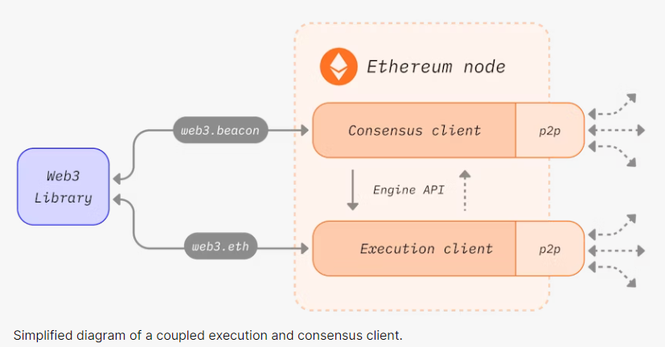
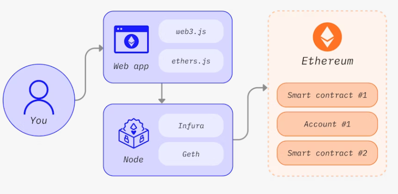

# NODE AND CLIENTS
이더리움은 블록과 트랜잭션 데이터를 검증할 수 있는 소프트웨어를 운영하는 컴퓨터(노드)들의 기여로 구성됩니다.
소프트웨어는 반드시 개인의 컴퓨터에서 실행되어야 하고 이더리움 네트워크의 노드가 되어야 합니다.
노드가 되기 위해서 개별의 두 가지 소프트웨어가 요구됩니다.

# Prerequisites
개인이 운영하는 이더리움 클라이언트를 운영하려면 p2p 네트워크와 EVM 기초에 대한 개념을 이해하고 있어야합니다.  
EVM : https://ethereum.org/en/developers/docs/evm/  
INTRO TO ETHEREUM : https://ethereum.org/en/developers/docs/intro-to-ethereum/  

# WHAT ARE NODES AND CLIENT?

노드는 이더리움 클라이언트 소프트웨어의 인스턴스입니다. 이더리움 클라이언트는 이더리움 네트워크를 고숭하는 소프트웨어를 운영하고 다른 컴퓨터와 상호작용 합니다.
클라이언트는 이더리움의 구현체이고 프로토콜 규칙을 검증하고 유지하는 역할을 합니다. 하나의 노드는  consensus client 와 execution client를 실행해야 합니다.

- execution client(Execution Engine, EL 혹은 Eth1 client으로 알려져 있습니다.) 이더리움 네트워크에서 새로운 트랜잭션 전파를 항상 listen하고 있습니다.
 EVM에서 실행되고 최신의 이더리움 데이터의 DB와 상태의 최신 버전을 유지합니다.
- consensus client (Beacon Node 라고 알려져있고 또는 CL client 혹은 Eth2 client) POS(Proof of Stake) 합의 알고리즘의 구현체이고
  validator로 알려진 third piece 소프트웨어도 존재하며 이는 합의 클라이언트에 추가되어 노드가 네트워크 보안에 참여할 수 있게 해줍니다.

클라이언트는 이더리움 체인의 head를 추적하고 사용자들이 이더리움 네트워크와 상호작용 할 수 있도록 허용해줍니다.
여러 소프트웨어들과 함께 동작될 수 있도록 모듈식으로 디자인 된 것을 encapsulated complexity라고 합니다.

encapsulated complexity : https://vitalik.eth.limo/general/2022/02/28/complexity.html

이런 방식은 seamlessly하게 하고 쉽게 Merge를 할 수 있도록 해줍니다 그리고 클라이언트 소프트웨어의 유지보수를 쉽게 해줍니다.
그리고 개별 클라이언트를 재사용할 수 있도록 해줍니다, layer2 ecosystem 과 같은 예시가 있지요.

execution clients, consensus clients 는 모두 다양한 팀들에 의해서 개발된 다양한 언어들로 구현될 수 있습니다.

다양한 언어들로 구현된 클라이언트는 네트워크를 단일 코드 기반에 대한 의존성을 감소시키고 네트워크를 더욱 더 강력하게 만듭니다.
이런 목표는 특정 언어의 클라이언트가 이더리움 네트워크를 독점하는 것을 배제하기 위함입니다.
또한 다양한 언어를 사용할 수 있다는건 더 넓은 개발자 커뮤니티를 확보할 수 있고 각 개발자들 그들이 선호하는 언어로 이더리움 네트워크에 통합 할 수 있음을 의미합니다.

client diversity : https://ethereum.org/en/developers/docs/nodes-and-clients/client-diversity/

...

# Why should I run an Ethereum node?

노드를 운영하는것은 이더리움 네트워크를 좀더 강력하고 탈중앙성을 유지함과 동시에, 이더리움 네트워크를 개인적으로,
신뢰를 검증할 필요 없이 사용할 수 있게 됩니다.

# Benefits to you
개인의 노드를 운영하는것은 이더리움을 private 하게 사용할 수 있게 되고, 자급자족과 신뢰성이 필요헚는 방식입니다.(self-sufficient and trustless manner)
네트워크를 신뢰할 필요가 없습니다. 왜냐하면 노드를 운영한다는 건 이미 본인이 운영하고 있는 클라이언트로 데이터를 검증할 수 있다는 의미이죠.
"신뢰하지말고 검증하라"가 블록체인의 철학입니다.

# Network benefits

노드들의 다양한 집합은 이더리움 네트워크의 건강에 중요한 점입니다. 보안과 운영회복력( security and operational resiliency ) 같은 것들이죠.
